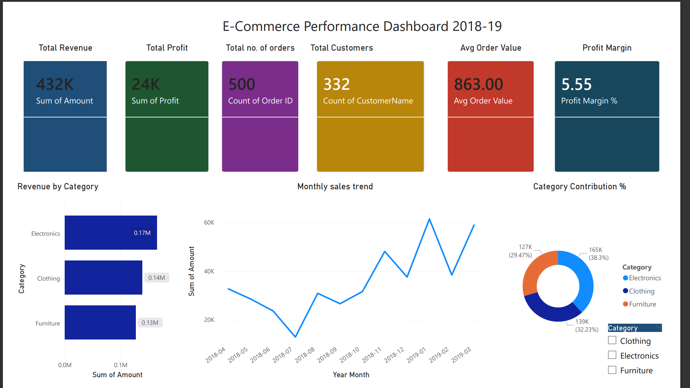
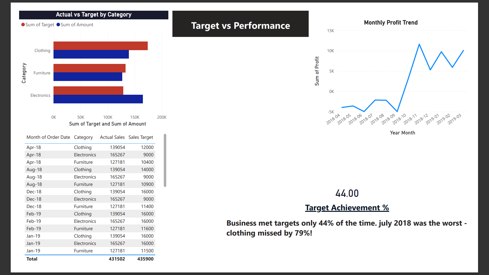
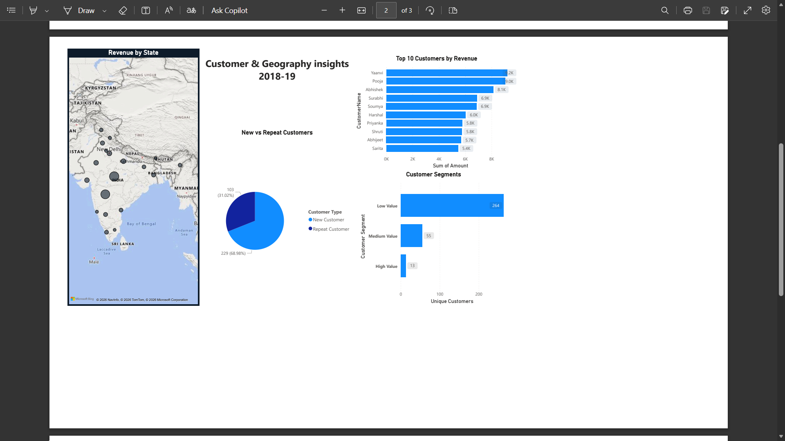

# 🛒 E-Commerce Sales Analysis (2018-2019)

### Page 1 — Executive Summary

### Page 2 — Customer & Geography  

### Page 3 — Target vs Actual

## 📌 Project Overview
This project analyzes an Indian E-Commerce business dataset covering 500 orders 
across 12 months (April 2018 – March 2019). The goal was to extract actionable 
business insights using SQL and visualize them using Power BI.

## 🛠️ Tools Used
- **MySQL** — Data extraction and analysis
- **Power BI** — Interactive dashboard (3 pages)
- **Excel** — Data preparation

## 📊 Dataset
| Table | Rows | Description |
|-------|------|-------------|
| order_list | 500 | Order ID, Date, Customer, State, City |
| order_details | 1500 | Amount, Profit, Quantity, Category |
| sales_target | 36 | Monthly targets by category |

## 💡 Key Business Insights
- 📦 **Electronics** generates highest revenue (38.3%) but **Clothing** is most profitable (8.03% margin)
- 🪑 **Tables** and **Electronic Games** are loss-making sub-categories
- 👥 **69% customer churn** — most customers never returned after first order
- 🗺️ **Tamil Nadu** has -36.41% profit margin — business loses money there
- 📅 **July 2018** was worst month (-45% drop) — **January 2019** was best (+63% growth)
- 🎯 Business met targets only **44% of the time**

## 📁 Project Structure
